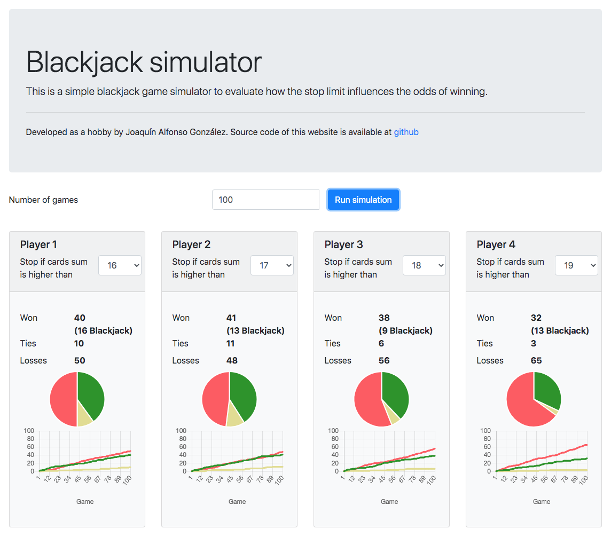

# Blackjack Simulator
This is a simple blackjack game simulator to evaluate how the stop limit influences the odds of winning.

You can try it here https://joaquinalfonso.github.io/Blackjack-Simulator/



## Details

* Developed in html + css + javascript
* Simulate a game with 4 players
* It is not considered bets, spliting, etc...
* If a dealer has less than 17, they must continue drawing cards until they reach 17 or above.
* Can be set:
    * Number of games or rounds to simulate
    * Stop limit for each player

## Running on localhost
```
npm install --global http-server
cd src
http-server
```
